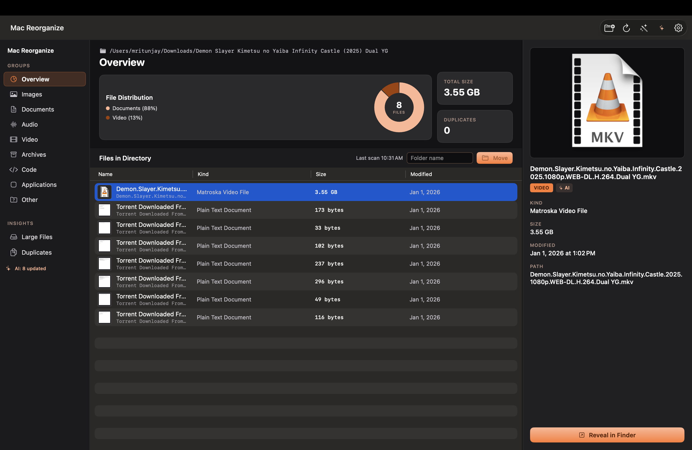
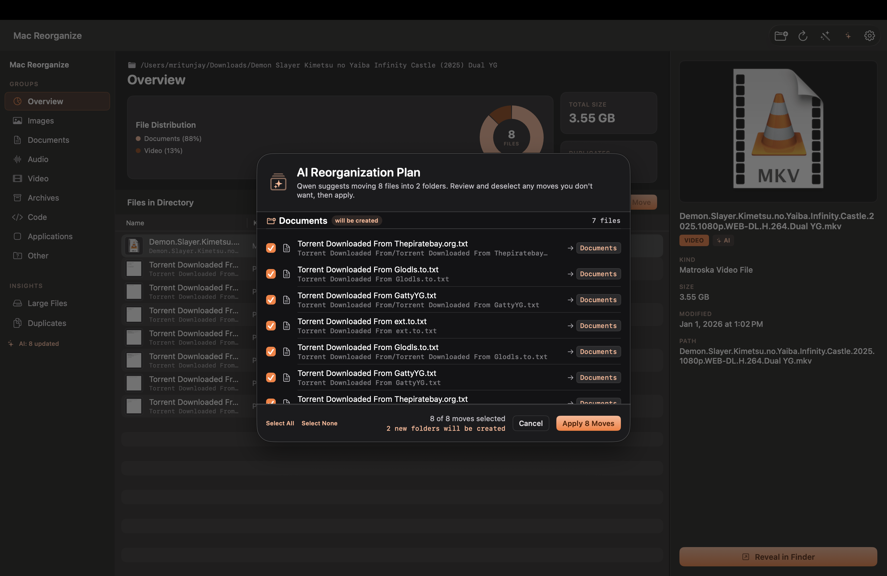
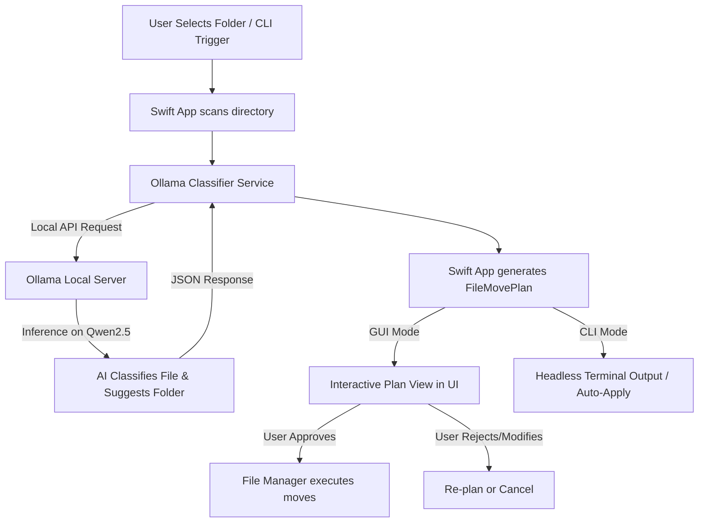

# 📂 Orbin

An AI-powered local macOS utility that reorganizes cluttered folders by automatically classifying files and suggesting logical directory structures. It uses a **local Qwen model** running via **Ollama**—ensuring absolute privacy with no internet connection required at runtime.

Can be run as a sleek native macOS desktop app or headless from the command line / background scripts.

<p align="center">
  
  
</p>

---

## 🏗️ Architecture & Workflow



---

## ✨ Features

- **Local AI Classification**: Runs completely offline using highly-optimized Qwen models.
- **Smart Folder Suggestions**: Generates descriptive folder names (e.g. *Finance*, *Code Projects*) instead of generic extensions.
- **Interactive & Headless Modes**: Use the GUI for visual review, or trigger headless scans from background scripts and terminal pipelines.
- **Modern SwiftUI Design**: Native macOS layout with custom sidebar, file table, visual charts, and metadata inspector.
- **Dynamic Appearance**: Features a custom rust/amber theme synced with the app icon, alongside a convenient Light/Dark mode toggle.
- **Automated Bootstrap**: Setup script manages downloading Ollama, fetching models, compiling, and launching.

---

## 💻 Background & CLI Mode

Orbin includes built-in headless CLI functionality so you can organize folders directly from terminal or schedule background cron/launchd jobs without opening the UI window.

```bash
# Preview moves (dry-run)
./script/build_and_run.sh --cli ~/Downloads --dry-run

# Automatically apply moves without confirmation
./script/build_and_run.sh --cli ~/Downloads --apply

# Use instant rule-based category folders instead of AI
./script/build_and_run.sh --cli ~/Downloads --apply --no-ai
```

Or run the compiled executable directly:
```bash
.build/debug/Orbin --cli ~/Downloads --apply
```

---

## 🚀 Setup & Running GUI

We provide a wrapper script that automates the setup, compilation, and launch of the app.

1. **Clone the repository** (or navigate to the project directory).
2. **Run the build script**:
   ```bash
   ./script/build_and_run.sh
   ```

### What the script does:
- Checks if **Ollama** is installed (installs via `brew` if missing).
- Asks you to select a Qwen model size (e.g., `qwen2.5:1.5b` for 8GB RAM, up to `32b` for high-end Macs).
- Starts the Ollama server in the background and pulls the chosen model.
- Compiles the Swift executable using `swift build`.
- Manually bundles it into a standalone Mac Application (`dist/Orbin.app`).
- **Generates the App Icon** (`AppIcon.icns`) dynamically from `assets/organizer.png`.
- Launches the application.

---

## 📁 Project Structure

```
├── Sources/
│   └── Orbin/
│       ├── App/              # OrbinApp.swift & AppLauncher (@main)
│       ├── Models/           # App Models (AppColorScheme, FileMovePlan)
│       ├── Services/         # CLIHandler, Ollama API Client & Classifier Pipeline
│       ├── Stores/           # State Management (OrganizerStore)
│       ├── Support/          # Utilities & Formatting (AppTheme)
│       └── Views/            # SwiftUI Views (ContentView, SidebarView, DetailView)
├── assets/                   # App Assets (organizer.png, AppIcon.icns, snapshots)
├── script/                   # Build and setup automation
│   └── build_and_run.sh      # Core compiler & launcher script
├── Package.swift             # Swift Package Manager Manifest
└── README.md                 # This file
```
