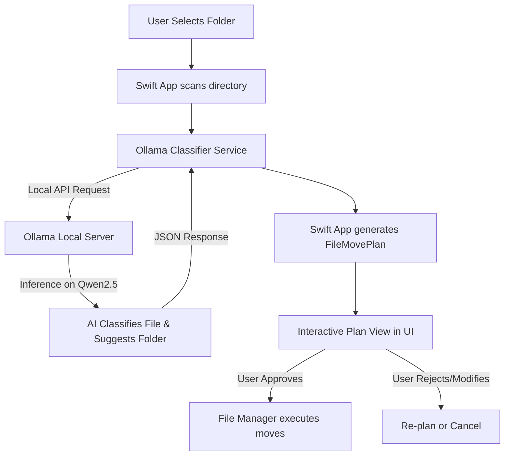

# 📂 MacReorganize

An AI-powered local macOS utility that reorganizes cluttered folders by automatically classifying files and suggesting logical directory structures. It uses a **local Qwen model** running via **Ollama**—ensuring absolute privacy with no internet connection required at runtime.

The interface is custom-themed (accented in rust/orange) to match the app icon, featuring a modern SwiftUI Split View and native Light/Dark mode toggling.

---

## 🏗️ Architecture & Workflow



---

## ✨ Features

- **Local AI Classification**: Runs completely offline using highly-optimized Qwen models.
- **Smart Folder Suggestions**: Generates descriptive folder names (e.g. *Finance*, *Code Projects*) instead of generic extensions.
- **Interactive Dry-Run**: Review what the AI plans to move before any file is touched.
- **Modern SwiftUI Design**: Native macOS Split-View layout with sidebar, file table, visual charts, and metadata inspector.
- **Dynamic Appearance**: Features a custom rust/orange theme synced with the app icon, alongside a convenient Light/Dark mode toggle directly in the toolbar.
- **Automated Bootstrap**: Setup script manages downloading Ollama, fetching models, and launching servers.

---

## 🛠️ Prerequisites

Ensure you have the following installed on your Mac:
1. **Homebrew** (Optional: the script can attempt to install Ollama via Homebrew if missing).
2. **Swift / Xcode Command Line Tools** (Required to compile the Swift project).
3. **Ollama** (Automatically managed by the bootstrapper, or run manually).

---

## 🚀 Setup & Running

We provide a wrapper script that automates the setup, compilation, and launch of the app.

1. **Clone the repository** (or navigate to the project directory).
2. **Run the build script**:
   ```bash
   ./script/build_and_run.sh
   ```

### What the script does:
- Checks if **Ollama** is installed (installs via `brew` if missing).
- Asks you to select a Qwen model size (e.g., `qwen2.5:1.5b` for 8GB RAM, up to `32b` for high-end Macs).
- Starts the Ollama server in the background and pulls the chosen model.
- Compiles the Swift executable using `swift build`.
- Manually bundles it into a standalone Mac Application (`dist/MacReorganize.app`).
- **Generates the App Icon** (`AppIcon.icns`) dynamically from `assets/organizer.png`.
- Launches the application.

---

## 📁 Project Structure

```
├── Sources/
│   └── MacReorganize/
│       ├── App/              # App entrypoint & AppDelegate
│       ├── Models/           # App Models (AppColorScheme, FileMovePlan)
│       ├── Services/         # Ollama API Client & Classifier Pipeline
│       ├── Stores/           # State Management (OrganizerStore)
│       ├── Support/          # Utilities & Formatting (AppTheme)
│       └── Views/            # SwiftUI Views (ContentView, SidebarView, DetailView)
├── assets/                   # App Assets (organizer.png, AppIcon.icns)
├── script/                   # Build and setup automation
│   └── build_and_run.sh      # Core compiler & launcher script
├── Package.swift             # Swift Package Manager Manifest
└── README.md                 # This file
```

---

## 🎨 App Theme & Colors

The app uses a custom visual style adapted to the dominant colors of the application icon (`assets/organizer.png`):
* **Accent Color**: Rust Orange (`#C84B00`) used for active tabs, buttons, and highlights.
* **Secondary Highlight**: Light Coral Pink (`#E1C8C8`).
* **Appearance Toggle**: Supports native System settings, or manual overrides (Light/Dark mode) via the `[Sun] (o-) [Moon]` switch on the toolbar.
